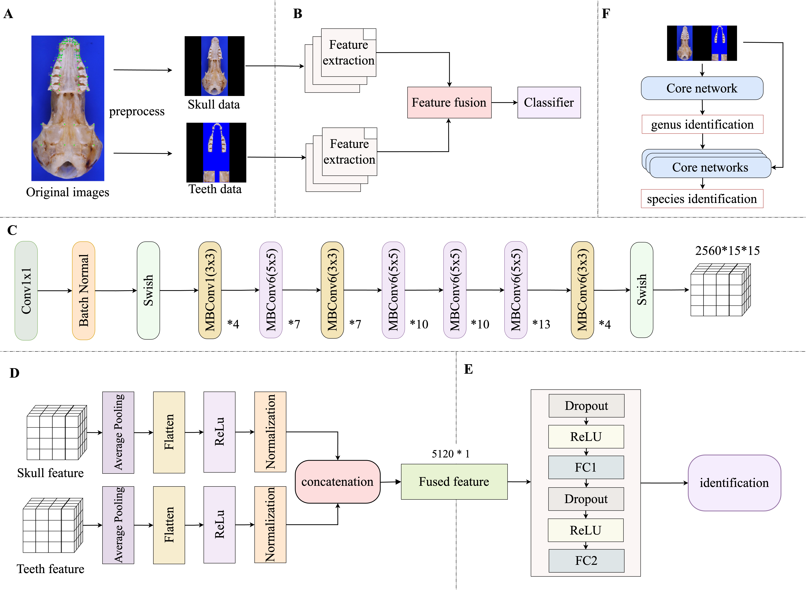

# HISNET-FF: Hierarchical Identification of Species using a Network with Fused Cranial and Dental Features

This project implements a deep learning-based hierarchical classification framework. By fusing features from global and local images, it achieves accurate identification at both the genus and species levels for mammals:



# Initialization

## Setup

Clone the repository and navigate to the project directory:

```bash
git clone https://github.com/Onlyroad2n/HISNET-FF.git
cd HISNET-FF
```

## Dependencies

Our implementation is based on [PyTorch](https://pytorch.org). We recommend using `conda` to create the environment and install dependencies.Select the appropriate `cudatoolkit` version according to your system:

```
conda create --name HISNET-FF python=3.9
conda activate HISNET-FF
conda install pytorch==2.0.1 torchvision==0.15.2 pytorch-cuda=11.8 -c pytorch -c nvidia
pip install -r requirements.txt
```

## Datasets

Download the [HISNET‑FF dataset](https://example.com/hisnet-ff.zip) and unzip it to the datasets folder.
HISNET‑FF is provided here as an example ("toy") dataset for demonstration purposes.
It contains high‑quality images of mole (family Talpidae) skulls, covering two genera and four species, organized as follows:

```text
./datasets
├── cranium
│   └── [dataset_name]
│       ├── train
│       │   ├── [genus_A]
│       │   │   └── [species_A1]
│       │   │       ├── xxx.jpg
│       │   │       └── ...
│       │   └── [genus_B]
│       │       └── ...
│       └── test
│           └── ...
└── teeth
    └── [dataset_name]
        ├── train
        │   └── ...
        └── test
            └── ...
```

## Config
Set root paths to datasets in `config.py`

# Usage

Please follow the steps below to run the complete training and evaluation process.

## Pretrain the backbone network (train.py)

First, we need to train genus-level and species-level models for the `global` and `local` data types, respectively.
> **Attention**: In the example project, the global type is "cranium" and the local type is "teeth". You can replace them with any combination that helps your species identification research.

**Example: Training a genus-level model for `cranium`**
```bash
python train.py --mode genus --data_type cranium --dataset_name mole --model_name efficientnet_b7 --input_size 600 --learning_rate 0.01 --step_size 10 --epochs 100 --patience 20 --num_workers 4 --batch_size 4 --device cuda:0
```

**Example: Training a species-level model for `teeth` in the genus `Euroscaptor`**
```bash
python train.py --mode species --target_genus Euroscaptor --data_type teeth --dataset_name mole --model_name efficientnet_b7 --input_size 600 --learning_rate 0.01 --step_size 10 --epochs 100 --patience 20 --num_workers 4 --batch_size 4 --device cuda:0
```
> **Attention**: Repeat this step for both cranium and teeth data types, and for all genera and species you want to classify. The trained weights will be defaultly saved in the ./weights/pretrain directory.

## Logging

Logging is performed using Tensorboard.The training process will generate logs in the weights/pretrain directory.

```bash
tensorboard --logdir ./weights/pretrain
```

## Feature extraction (extract_features.py)

After training the backbone network, we need to use it to extract features for subsequent fusion model training.

**Example: Extracting genus-level features of `cranium`**
```bash
python extract_features.py --weights_path ./weights/pretrain/genus/cranium/best_network.pth --mode genus --data_type cranium --dataset_name mole --model_name efficientnet_b7 --input_size 600 --batch_size 16 --device cuda:0
```
> **Attention**: Repeat this step for all trained models. The extracted features will be defaultly saved in the ./features directory.

## Feature-Fusion MLP training (train_fusion_mlp.py)

Now, we can train the feature fusion MLP based on `cranium` and `teeth` features

**Example: Training a genus-level fusion model**
```bash
python train_fusion_mlp.py   --mode genus   --teeth_ratio 1.0   --cranium_ratio 1.0   --hidden_dim 1024   --epochs 100   --batch_size 64   --lr 0.001   --patience 20   --dropout 0.5   --device cuda:0
```

**Example: Training a species-level fusion model for the genus `Mogera`**
```bash
python train_fusion_mlp.py --mode species --target_genus Mogera --teeth_ratio 1.0 --cranium_ratio 1.0 --hidden_dim 1024 --epochs 100 --batch_size 64 --lr 0.001 --patience 20 --dropout 0.5 --device cuda:0
```
> **Attention**: Repeat this step for all extracted features. The trained fusion-weights will be defaultly saved in the ./weights/fusion directory.

## Evaluation

Finally, we can evaluate the performance of the hierarchical model.

**Evaluating base models (e.g. `cranium`)**
```bash
python test_hierarchical.py --data_type cranium --dataset_name mole --model_name efficientnet_b7 --input_size 600
```

**Evaluating the fusion model**
```bash
python test_hierarchical.py --fusion --dataset_name mole --model_name efficientnet_b7 --input_size 600
```

